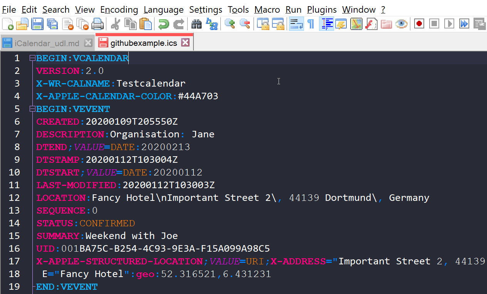
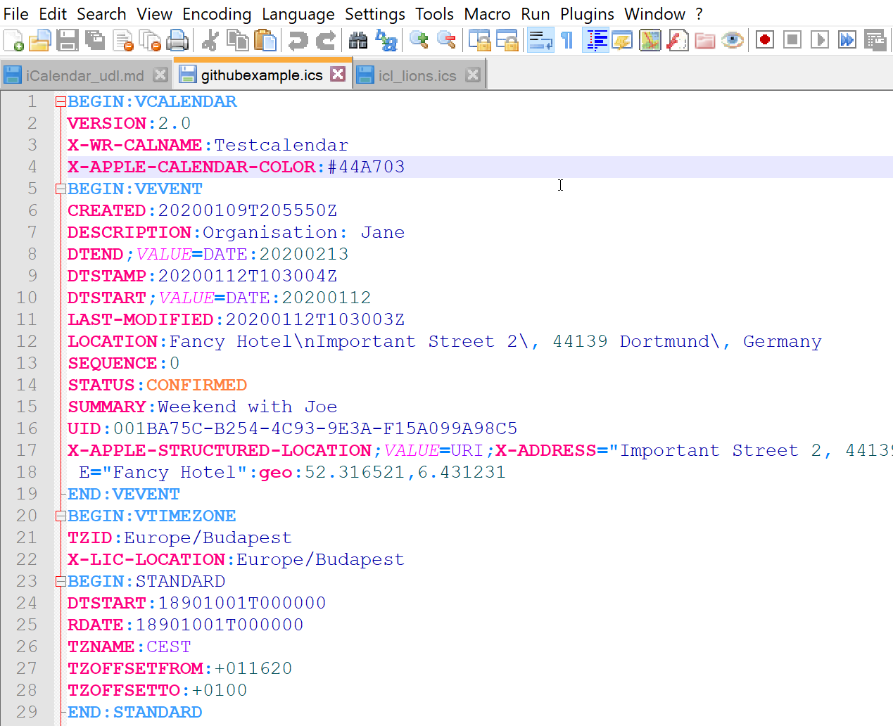

# iCalendar-UDL

[Again](https://github.com/zorwald/vCard-UDL/blob/master/README.md), I was looking for an UDL file for Notepad++ as I was editing iCalendar/iCal/ics files. 
Since I couldn't find one, I just created one myself. 

I included properties and keywords from different sources:
* IETF RFC5545, Internet Calendaring and Scheduling Core Object Specification (https://tools.ietf.org/html/rfc5545)
* iCalendar Wikipedia Article, retreived Feb. 26 2020, (https://en.wikipedia.org/wiki/ICalendar)
* an export of my own Apple calendar for Apple-specific keywords

This means, that keyword highlighting should work for all official iCalendar files up until now. And moreover additional parameters and properties as described above.
I created two versions - one for the default theme, and one for a dark theme [(in my case Dracula)](https://github.com/dracula/notepad-plus-plus). 
For the **dark theme**, I recommend you switch on *"Enable global background colour"* in *"Global override"* style (Settings **>** Style Configurator)

## File extensions
ical ics ifb icalendar

## Keywords included

### Properties
CALSCALE METHOD PRODID VERSION ATTACH CATEGORIES CLASS COMMENT DESCRIPTION GEO LOCATION PERCENT-COMPLETE PRIORITY RESOURCES STATUS SUMMARY COMPLETED DTEND DUE DTSTART DURATION FREEBUSY TRANSP TZID TZNAME TZOFFSETFROM TZOFFSETTO TZURL ATTENDEE CONTACT ORGANIZER RECURRENCE-ID RELATED-TO URL UID EXDATE EXRULE RDATE RRULE ACTION REPEAT TRIGGER CREATED DTSTAMP LAST-MODIFIED SEQUENCE REQUEST-STATUS X-TITLE X-APPLE-STRUCTURED-LOCATION X-ADDRESS X-APPLE-RADIUS X-APPLE-REFERENCEFRAME X-CALENDARSERVER-DTSTAMP X-APPLE-MAPKIT-HANDLE X-APPLE-ABUID X-LIC-LOCATION

### Parameters
ALTREP CN CUTYPE DELEGATED-FROM DELEGATED-TO DIR ENCODING FMTTYPE FBTYPE LANGUAGE MEMBER PARTSTAT RANGE RELATED RELTYPE ROLE RSVP SENT-BY TZID VALUE AUDIO DISPLAY EMAIL PROCEDURE SCHEDULE-STATUS FREQ UNTIL

### Misc (including Calendar User Types, Free/Busy Time Types, Participation Statuses, Relationship Types, Participation Roles, Actions, Classifications
INDIVIDUAL GROUP RESOURCE ROOM UNKNOWN FREE BUSY BUSY-UNAVAILABLE BUSY-TENTATIVE NEEDS-ACTION ACCEPTED DECLINED TENTATIVE DELEGATED IN-PROCESS CHILD PARENT SIBLING CHAIR REQ-PARTICIPANT OPT-PARTICIPANT NON-PARTICIPANT PUBLIC PRIVATE CONFIDENTIAL CONFIRMED CANCELLED DRAFT FINAL

### Value Data Types
BINARY BOOLEAN CAL-ADDRESS DATE DATE-TIME DURATION FLOAT INTEGER PERIOD RECUR TEXT TIME URI UTC-OFFSET TRUE YEARLY BYMONTH BYDAY CET CEST CEMT

### Components
VCALENDAR VEVENT VTODO VJOURNAL VFREEBUSY VTIMEZONE VALARM STANDARD DAYLIGHT VERSION X-WR-CALNAME X-APPLE-CALENDAR-COLOR
